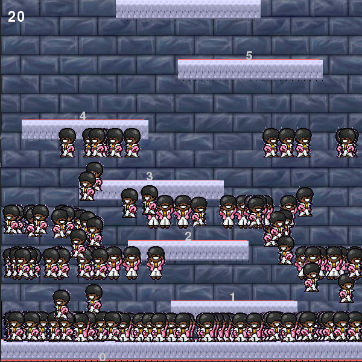

# Icy Tower AI
By [Lidor Shimoni](https://github.com/lidorshimoni)

An Icy Tower Game Built with PyGame and AI with NEAT genetics algorithm.

## Features
* Normal
* Train Bot
* Test Bot


## Examples



## Running

-Playing normal:


```
python game.py -normal
```

Bot Training:


```
python game.py -train
```


## Dependencies
The following dependencies are required:
* python 3.7
* pygame
* Graphiz
* python-neat 

 ## Refrences 
 TODO
